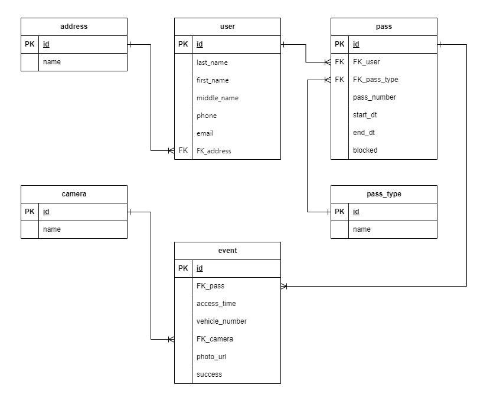

# Data base for smart gate

## Навигация:
[Описание](#title1)
[ER-диаграмма](#title2)
[Сущности](#title3)
[Типы данных](#title4)
[Индексы](#title5)
[DDL](#title6)
[DML](#title7)
[Хранимые процедуры](#title8)
[Функции](#title9)

## <a id="title1">Описание</a>
Проект Smart-gate-db представляет собой модель базы данных для системы управления доступом, которая позволяет контролировать въезд и выезд транспортных средств на основе звонка с телефона или распознавания номера транспортного средства с помощью камер. Эта система использует базу данных PostgreSQL для хранения информации о пользователях, пропусках и событиях.
Пропуск может иметь дату начала и окончания действия, а также статус активности. События фиксируют дату и время проезда, тип события (въезд или выезд), номер транспортного средства и факт успешного доступа.

Основные функции:  
- Управление доступом: Позволяет автоматически разрешать или запрещать въезд и выезд транспортных средств на основе данных, хранящихся в базе данных PostgreSQL.  
- Интеграция с телефоном: Пользователи могут запросить доступ к шлагбауму путем звонка с зарегистрированного номера телефона.  
- Распознавание номеров транспортных средств: Система также способна распознавать номера транспортных средств с помощью камер на въезде и выезде, позволяя автоматически разрешать доступ на основе зарегистрированных данных в базе.  
- Управление пользователями: Позволяет администраторам добавлять, и редактировать пользователей и их привязанные данные.  

## <a id="title2">ER-диаграмма</a>

## <a id="title3">Сущности</a>
#### 1. User (Пользователи)
- id (Primary Key)
- last_name (фамилия)
- first_name (имя)
- middle_name (отчество)
- phone (номер телефона пользователя, уникальный)
- email (email адрес)
- address (наименование адреса)

#### 2. Pass (Объекты доступа)
- id (Primary Key)
- FK_user (внешний ключ, связанный с таблицей user)
- phone_number (номер телефона)
- vehicle_number (номер транспортного средства)
- start_date (дата начала)
- end_date (дата окончания)
- blocked (блокировка: да/нет)

#### 3. Camera (Камеры)  
- id (Primary Key)
- name  (наименование камеры)

#### 4. Event (Журнал событий)
- id (Primary Key)
- FK_pass (внешний ключ, связанный с таблицей pass)
- event_time (время события)
- vehicle_number (номер транспортного средства)
- FK_camera (внешний ключ, связанный с таблицей camera)
- photo_url (cсылка на фотографию)
- success (успешный доступ: да/нет)
- note (примечание)

## <a id="title4">Типы данных</a>

## <a id="title5">Индексы</a>

## <a id="title6">DDL</a>
[DDL.sql](DDL.sql)
## <a id="title7">DML</a>
[DML.sql](DML.sql)
## <a id="title8">Хранимые процедуры</a>
#### 1. Управление доступом:
- Создание пользователя [procedure_create_user.sql](procedure_create_user.sql)
- Добавление пропуска по номеру телефона [procedure_add_pass_phone.sql](procedure_add_pass_phone.sql)
- Добавление пропуска по номеру траспортного средства [procedure_add_pass_vehicle.sql](procedure_add_pass_vehicle.sql)
- Изменение пропуска по номеру телефона [procedure_edit_pass_phone.sql](procedure_edit_pass_phone.sql)
- Изменение пропуска по номеру траспортного средства [procedure_edit_pass_vehicle.sql](procedure_edit_pass_vehicle.sql)
- Блокировка всех объектов доступа по номеру телефона пользователя [procedure_block_allpass.sql](procedure_block_allpass.sql)
- Разблокировка всех объектов доступа по номеру телефона пользователя [procedure_unblock_allpass.sql](procedure_unblock_allpass.sql)

#### 2. Статистика:
- Вывод всех пользователей и всех объектов доступа со статусом
- Вывод всех пользователей и всех объектов доступа по адресу со статусом
- Вывод всех объектов доступа по пользователю со статусом
- Въезд/выезд по камере
- Въезд/выезд  по номеру телефона

#### 3. Добавление событий
- Въезд по камере [procedure_add_event_camera_in.sql](procedure_add_event_camera_in.sql)
- Выезд по камере [procedure_add_event_camera_out.sql](procedure_add_event_camera_out.sql)
- Въезд/выезд по номеру телефона [procedure_add_event_call.sql](procedure_add_event_call.sql)
## <a id="title9">Функции</a>
[generate_photo_name.sql](function_generate_photo_name.sql)

